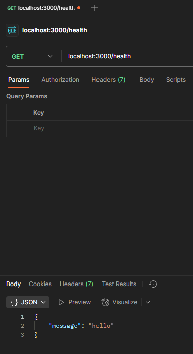

# 2 - Getting Started with Express

## 2.1 - Creating an Express application

First steps to create an Express app:

```ts
import express from "express";

const app = express();

app.get("/health", (req, res) => {
  res.status(200).json({ message: "hello" });
});

export { app };

export default app;
```

> A /health route is a common convention used to check if a server is still running and operational, typically pinged at intervals to ensure the server's availability and responsiveness

```ts
import { app } from "./server.ts";

app.listen(3000, () => {
  console.log("server running on port: 3000");
});
```

## 2.2 - Testing APIs with Postman

Postman will be useful to test and visualize the API outputs as seen below:



## 2.3 - Environment Variables

### What Are Environment Variables?

**Environment variables** are values provided by the environment where an application runs.

They are commonly used for **configuration and secrets** without hardcoding values into the source code.

### Frontend vs Backend

| **Feature**             | **Frontend**                          | **Backend (Node.js)**                     |
| ----------------------- | ------------------------------------- | ----------------------------------------- |
| **Example**             | `import.meta.env.VITE_API_URL`        | `process.env.DATABASE_URL`                |
| **Where it runs**       | Browser                               | Server                                    |
| **How it works**        | Value is injected into the built code | Value is read from the server environment |
| **When it is resolved** | Usually at build time                 | Runtime                                   |
| **Visible in final JS** | ✅ Yes                                | ❌ No                                     |
| **Accessible by users** | ✅ Yes                                | ❌ Normally no                            |
| **Safe for secrets**    | ❌ Never                              | ✅ Yes, if kept server-side               |
| **Main purpose**        | Public configuration                  | Configuration & secrets                   |
| **Common examples**     | API URL, feature flags                | DB URL, API keys, JWT secrets             |

In the frontend, environment variables are typically **replaced with their actual values during the build**.

```ts
// Frontend source
const url = import.meta.env.VITE_API_URL;

// Built JavaScript (simplified)
const url = "https://api.example.com";
```

> **Frontend environment variables should always be treated as public.**

### The Problem with `process.env`

In Node.js, environment variables are exposed as `string | undefined` and have no runtime validation.

```ts
const port = process.env.PORT;
const dbUrl = process.env.DATABASE_URL;
```

| Problem        | Example                            |
| -------------- | ---------------------------------- |
| Wrong type     | `PORT` is `"3000"`, not `3000`     |
| Missing values | `DATABASE_URL` may be `undefined`  |
| Invalid values | `PORT="abc"` is accepted           |
| No validation  | Errors may happen later at runtime |

### Type-Safe Environment Variables

Use **Zod** to validate, convert, and type environment variables when the application starts in runtime.

```ts
import { z } from "zod";

const envSchema = z.object({
  NODE_ENV: z
    .enum(["development", "production", "test"])
    .default("development"),

  PORT: z.coerce.number().positive().default(3000),

  DATABASE_URL: z.string().startsWith("postgresql://"),

  JWT_SECRET: z.string().min(32),

  LOG_LEVEL: z.enum(["error", "warn", "info", "debug"]).default("info"),
});

export const env = envSchema.parse(process.env);

export type Env = z.infer<typeof envSchema>;
```

### What Zod Does

| Feature        | Example                               |
| -------------- | ------------------------------------- |
| Validation     | `JWT_SECRET` must have 32+ characters |
| Conversion     | `"3000"` → `3000`                     |
| Defaults       | Missing `PORT` → `3000`               |
| Type inference | `env.PORT` → `number`                 |
| Early errors   | Invalid config stops startup          |

### `process.env` vs Validated `env`

```ts
// ❌ Raw process.env
const port = process.env.PORT;
// string | undefined

const dbUrl = process.env.DATABASE_URL;
// string | undefined
```

```ts
// ✅ Validated env
const port = env.PORT;
// number

const dbUrl = env.DATABASE_URL;
// string
```

|                  | `process.env`         | Validated `env` |
| ---------------- | --------------------- | --------------- |
| **Types**        | `string \| undefined` | Correct types   |
| **Validation**   | ❌                    | ✅              |
| **Conversion**   | Manual                | Automatic       |
| **Defaults**     | Manual                | Schema          |
| **Early errors** | ❌                    | ✅              |

> **Rule of thumb:** validate `process.env` once at startup, then use the validated `env` object throughout the application.

> [!WARNING]
>
> ### 🔐 Security Best Practices
>
> 1. **Never commit `.env` files** — Add to `.gitignore`
> 2. **Use strong secrets** — Minimum 32 characters for JWT secrets
> 3. **Rotate secrets regularly** — Especially in production
> 4. **Use secret management** — AWS Secrets Manager, HashiCorp Vault
> 5. **Validate on startup** — Fail fast if configuration is wrong
